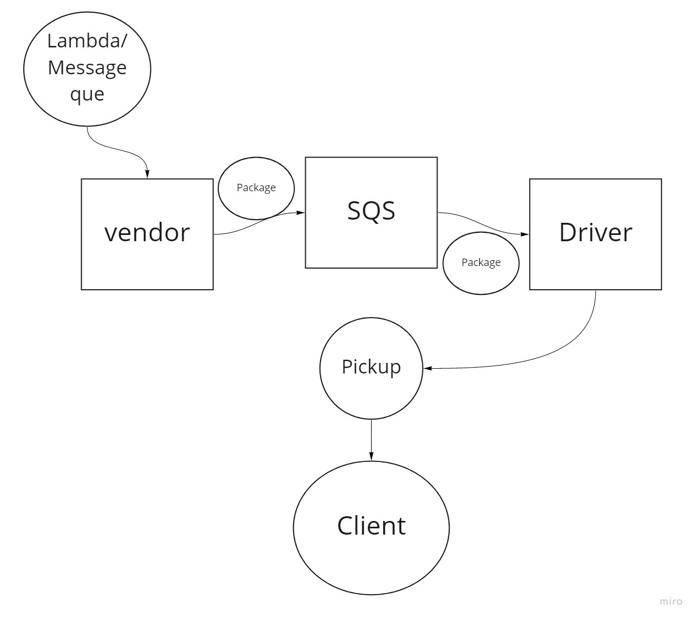
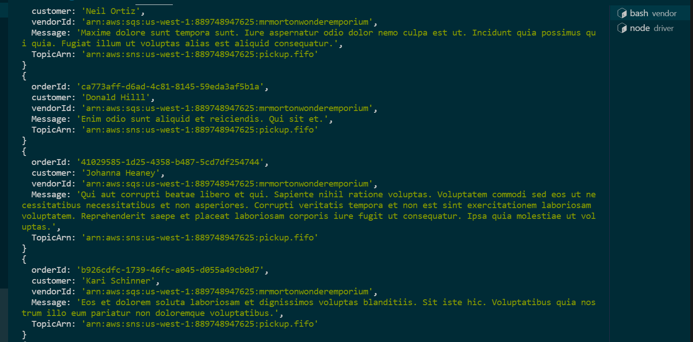
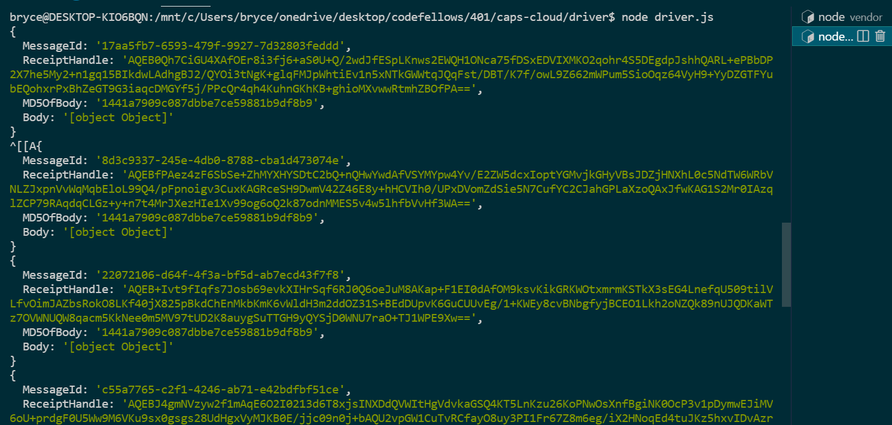

# caps-cloud

Created by Bryce Pfingston  

## Installation

npm i { uuid, aws-sdk, faker, sql-consumer }  
  
## Summary of Problem Domain  

Required Services

   1. SNS Topic: pickup which will receive all pickup requests from vendors

   2. SQS Queue (FIFO): packages which will contain all delivery requests from vendors, in order of receipt.
        - Subscribe this queue to the pickup topic so all pickups are ordered

   3. SQS Queue (Standard) for each vendor (named for the vendor) which will contain all delivery notifications from the drivers.

## Links to application deployment  

Githut: https://github.com/bpfingston/serverless-api  
  
## Include embedded UML  

## Include pictures of working

